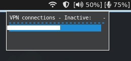

# Rofi VPN menu

## This fork
This fork removed the strange font setting within the script, as well as looking for connection of type 'Wireguard' instead of 'vpn'.

## Table of Contents
* [`Description`](#description): Generic description of this script.
* [`Requirements`](#requirements): Requirements / dependencies.
* [`Installation`](#installation): How to install this script.
* [`Usage`](#usage): How to use this script.
 * [`Polybar`](#polybar): Polybar menu bar configuration example.
* [`Limitations`](#limitations): Limitations of this script.
* [`Development`](#development): When you want to contribute to this script.
 * [`TODO`](#todo): List of things and ideas left to do.

## Description
This script creates a custom Rofi menu that allows for activating and deactivating
VPN connections through nmcli. When there is an active connection this connection
is shown in the menu, otherwise all of the available connections are listed.



## Requirements
This script depends on the following packages:
* `rofi`
* `networkmanager`
* `networkmanager-openvpn`

## Installation
Because the script is 'just' a bash script, it can be manually placed in any desired location.

## Usage
The script can be executed from bash or external tools that allow bash scripts to be used (like
the Polybar menu bar). When executing the script the custom rofi menu will be started.

If the `-h` flag is passed you will get a (very small) help / usage overview. 

### Polybar
An example configuration for Polybar can be found underneath:
```
[module/vpn]
type = custom/text
content = "%{A1:~/.scripts/polybar/rofi-vpn.sh:}  %{A}"
```

## Limitations
This menu only allows for existing connections to be activated / deactivated. Actions like
adding and removing connections is done through nmcli itself.

## Development
This project has been released under the Apache License 2.0 and is considered open software.
Everyone is permitted to make changes as long as the above license is followed.

See [our guidelines](https://wiki.itsburning.nl/bash:guide_lines) to learn about what
guidelines to follow.

### TODO

#### Automatically detect menu width
Currently the width of the menu is hardcoded. We could loop through the list of connections
and determine the amount of characters, which will give us the width of the menu.

#### Manage existing connections
This script only allows for existing VPN connections to be activated / deactivated. Adding and
removing connections is still done through `nmcli`. We could consider implementing an option
that allows us to manage the connections through this menu, but this might be out of the
scope of this menu / script.

